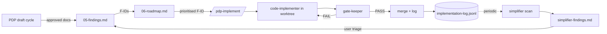

# `.claude/` — AKIS development tooling

> Bu klasör **AKIS ürününün kendisi değildir.** Bu klasör, AKIS'i geliştirmek için
> Claude Code üstüne kurduğumuz takım çantasıdır.

## What this folder is

AKIS Platform has two layers, and it matters that you don't mix them:

- **Layer A — the AKIS product.** Lives in `frontend/`, `backend/`, `docs/`, `scripts/`. This is the Scribe → Proto → Trace agent platform end users will eventually touch. Tests, deployments, and the OpenAPI surface all belong here.
- **Layer B — the development tooling.** Lives in `.claude/`. Subagents, skills, slash commands, hooks, and persistent state that **assist us while we build Layer A**. Nothing in this folder ships to a user; nothing here runs in production.

The split is real, not stylistic: a Layer B agent can read Layer A but should not mutate product code without going through a Layer B skill that enforces the gate matrix below. If a change to `.claude/` would also change `frontend/` or `backend/`, that is a sign the boundary is being crossed and the change should be split.

---

## Components map

```
.claude/
├── agents/        # 8 specialist subagents
├── skills/        # 5 protocols (multi-step procedures)
├── commands/      # 6 slash commands (user entry points)
├── hooks/         # 3 lifecycle hooks
├── state/         # 4 persistent files (JSON + JSONL + MD)
├── settings.json  # Claude Code config (committed)
├── settings.local.json  # per-machine overrides (gitignored)
└── README.md      # this file
```

### `agents/`
- **orchestrator** — top-level coordinator; owns `state/orchestrator.json`.
- **pdp-writer** — drafts Product Definition Pack documents in `docs/product/`.
- **pdp-reviewer** — critiques PDP drafts; produces blocking / non-blocking findings.
- **code-implementer** — turns approved findings (F-IDs) into commits inside a worktree.
- **gate-keeper** — runs typecheck + lint + tests + acceptance + FR-link gates.
- **simplifier** — periodic codebase + docs scan; writes `state/simplifier-findings.md`.
- **researcher** — read-only deep dive into codebase questions; no mutations.
- **release-coordinator** — bundles approved work into PRs; updates state on merge.

### `skills/`
- **pdp-cycle** — the loop: draft → review → revise → approve → write next doc.
- **gate-check** — the canonical 6-step gate matrix runner (used by `gate-keeper`).
- **parallel-implementation** — dispatches multiple `code-implementer` instances in worktrees.
- **simplify-scan** — protocol the `simplifier` follows when scanning Layer A.
- **session-resume** — at session start, reads state and offers to continue.

### `commands/`
- `/pdp-next` — open the next un-drafted PDP doc and route to `pdp-writer`.
- `/pdp-implement <F-id>` — pick a finding ID, open a worktree, hand to `code-implementer`.
- `/simplify-scan` — kick off a full simplifier sweep.
- `/gate` — run the gate matrix against current branch.
- `/status` — print orchestrator state in a human-friendly summary.
- `/resume` — explicit `session-resume` trigger if auto-detection didn't fire.

### `hooks/`
- `format-on-edit.sh` — Prettier on every Edit/Write touching `frontend/`/`backend/` files. Already wired.
- `post-doc-write.sh` — after a write to `docs/product/*.md`, runs FR-link lint and updates `pdp-progress.json`. **(to be wired in `settings.json`)**
- `pre-commit-gate.sh` — before any commit touching `backend/` or `frontend/`, runs lightweight typecheck + lint subset of the gate matrix. **(to be wired)**

### `state/`
See [`state/SCHEMA.md`](state/SCHEMA.md) for full schemas. Quick map:
- `orchestrator.json` — current initiative, in-flight tasks, worktrees, gate results.
- `pdp-progress.json` — per-document status (not_started / drafting / awaiting_review / approved / revising).
- `implementation-log.jsonl` — append-only commit-by-commit history with gate outcomes.
- `simplifier-findings.md` — dialogue file: simplifier proposes, you triage with `[ ]` / `[x]` / `[~]`.

---

## How to use

Three flows cover ~90% of daily work:

### "Bir sonraki PDP belgesini yazmak istiyorum"
```
/pdp-next
```
The command reads `state/pdp-progress.json`, finds the first doc whose status is `not_started` or `drafting`, and dispatches `pdp-writer`. When the draft is done, `pdp-reviewer` runs automatically; you only see findings if they're blocking.

### "Bir bulguyu (finding) hayata geçirmek istiyorum"
```
/pdp-implement F-01
```
The command resolves `F-01` to its acceptance criteria from `docs/product/05-findings.md`, opens a worktree (recorded in `state/orchestrator.json#worktrees`), and hands control to `code-implementer`. After commit, `gate-keeper` runs and writes a line to `implementation-log.jsonl`.

### "Acaba kod tabanı paslandı mı?"
```
/simplify-scan
```
Runs the `simplifier` over `frontend/`, `backend/`, and `docs/`. Findings are appended to `state/simplifier-findings.md`. You triage at your own pace — the simplifier never auto-deletes.

---

## Lifecycle



The arrow `J → B` is the important one: the simplifier doesn't fix things directly — it feeds future findings back into the PDP cycle, so cleanup goes through the same gate as features.

---

## State persistence

When a Claude Code session starts, the **`session-resume` skill** reads `state/orchestrator.json` and `state/pdp-progress.json` and prints a one-paragraph summary like:

> Initiative `INIT-0001` (PDP cycle) is in_progress. 02-ux is awaiting_review with 1 blocking finding. 1 worktree active (`wt-pdp-02` on `docs/pdp-02-ux`). Continue?

If you say yes, the orchestrator picks up exactly where the previous session paused — no re-explaining context, no re-discovering tasks. This is why mutations to state happen through skills, not free-form edits: the next session has to be able to trust the file.

---

## Gate matrix

Six gates, each runnable independently. Different triggers run different subsets:

| Gate | Pre-commit hook | `gate-keeper` | post-doc-write hook |
| --- | --- | --- | --- |
| `typecheck` (backend + frontend) | yes | yes | no |
| `lint` | yes | yes | no |
| `frontendTest` (vitest) | no | yes | no |
| `backendTest` (node --test, unit) | no | yes | no |
| `acceptance` (FR-id ↔ test mapping) | no | yes | no |
| `frLink` (every FR has at least one test or doc reference) | no | yes | yes |

Pre-commit is fast (typecheck + lint only). Full gate-keeper runs after `code-implementer` finishes a finding. Post-doc-write only checks FR-link integrity since it's the one gate a doc edit can break.

---

## Wiring

The hooks above need to be referenced in `settings.json` to fire. The format-on-edit hook is already wired; the two new hooks are not yet — you (or a setup command) add a snippet like:

```json
{
  "hooks": {
    "PostToolUse": [
      {
        "matcher": "Edit|Write",
        "hooks": [
          { "type": "command", "command": ".claude/hooks/format-on-edit.sh" },
          { "type": "command", "command": ".claude/hooks/post-doc-write.sh" }
        ]
      }
    ],
    "PreToolUse": [
      {
        "matcher": "Bash",
        "hooks": [
          { "type": "command", "command": ".claude/hooks/pre-commit-gate.sh" }
        ]
      }
    ]
  }
}
```

The `update-config` skill can do this for you (`/update-config wire akis hooks`) once the hook scripts exist on disk.

---

## See also

- [`docs/product/00-README.md`](../docs/product/00-README.md) — the **PDP umbrella**, which is the Layer A document describing what AKIS is. This README you're reading is **Layer B** — the tooling around the product. If you find yourself confused which layer something belongs to: does it ship to a paying user? Layer A. Does it only help us build? Layer B.
- [`state/SCHEMA.md`](state/SCHEMA.md) — exact JSON schemas of the state files.
- [`CLAUDE.md`](../CLAUDE.md) — repo-wide conventions (Layer A focus, but the format-on-edit hook reference lives there).
