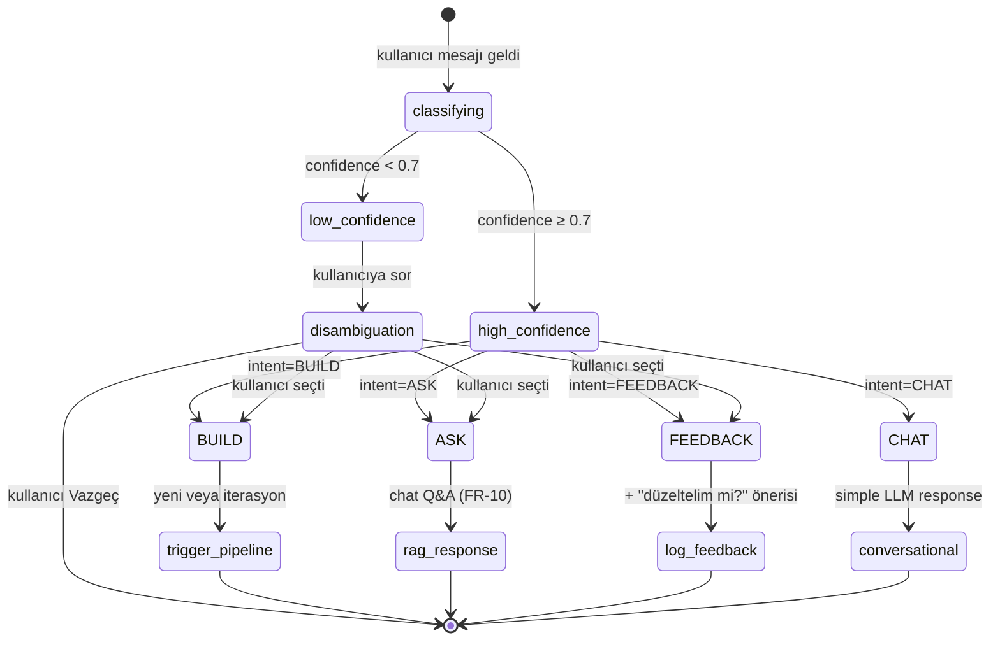
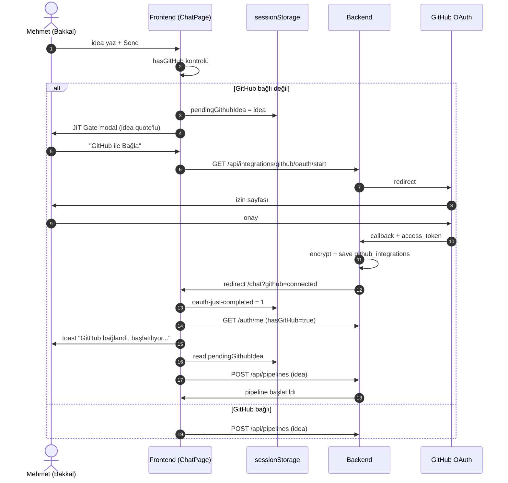
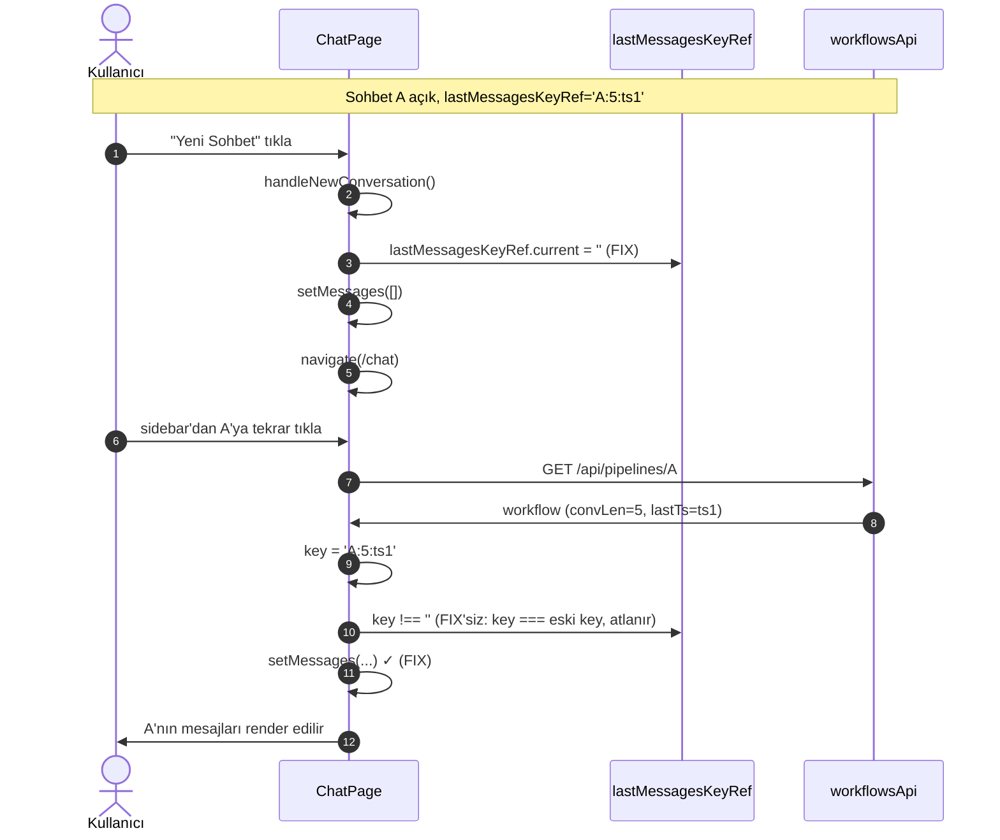
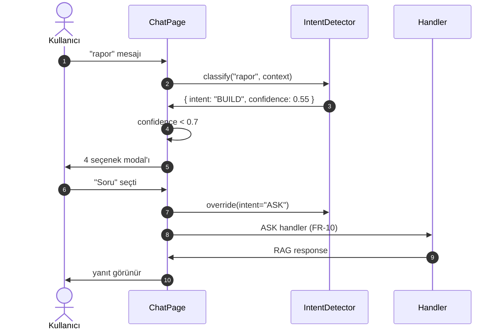

# 02 — UX & Akış Tasarımı

**Status:** ✅ Onaylandı — 2026-05-10 (kullanıcı sözel onayı: "hepsini onaylıyorum")
**Önceki bağlam:** [`00-README.md`](./00-README.md), [`01-requirements.md`](./01-requirements.md)
**Format:** Mermaid diagram'lar (GitHub markdown otomatik render eder) + ASCII wireframe'ler.

> **Sıralama:** önce kullanıcı öyküleri (storyboard) → sonra state machine → sonra kritik etkileşim sekansları → sonra ekran wireframe'leri → sonra bakkal-language sözlük.

---

## 1. Kullanıcı yolculukları (Storyboards)

### 1.1 İlk gün — Bakkal'ın AKIS ile tanışması (mutlu yol)

> **Persona:** Mehmet (52, bakkal sahibi, akıllı telefon kullanıyor, Excel temel düzey, kod yazmayı bilmiyor).
> **Hedef:** "Veresiye defterimi dijital yapsın istiyorum."

| Adım | Mehmet ne yapar? | AKIS ne gösterir? | İlişkili FR |
|---|---|---|---|
| 1 | `app.akis.local` adresine girer | Landing → Login/Signup ekranı | FR-1 |
| 2 | Email + parolayla kayıt olur | "Hoş geldin Mehmet" + boş `/chat` ekranı | FR-1.1 |
| 3 | Boş input'a fikrini yazar: "Bakkal için veresiye defteri istiyorum" | "Gönder" butonu aktif olur | FR-2.2 |
| 4 | Gönder'e basar | Modal açılır: **"Devam etmek için GitHub'ı bağla"** + Mehmet'in fikri quote'lu + 3 izin bullet'ı | FR-2.2 |
| 5 | "GitHub ile Bağla ve Devam Et"e basar | GitHub OAuth sayfasına yönlendirilir | FR-2.3 |
| 6 | GitHub'da onaylar | `/chat?github=connected` döner; toast: "GitHub bağlandı, başlatılıyor..." | FR-2.3 |
| 7 | Otomatik: pipeline başlar | Scribe yanıtı: "Birkaç sorum var..." + 4 multiple-choice soru | FR-3.1 |
| 8 | 4 soruyu cevaplar | Anlık sayaç: "1/4 ✓", "2/4 ✓", ..., "Gönder" aktif | FR-3.2 |
| 9 | Gönder'e basar | "Plan oluşturuluyor..." + activity timeline | FR-3.3 |
| 10 | Plan görünür | Plan card: özellikler listesi + teknik seçimler + ~12 dosya + Onayla/İptal | FR-3.4, FR-3.5 |
| 11 | Critic spec inceler | Pipeline detayı rail'inde **rose** Critic state aktif; "Spesifikasyon inceleniyor" | FR-4.1, FR-4.2 |
| 12 | Critic onaylar (skor 82) | Açıklama tab'ında findings görünür; plan card hâlâ "Onayla/İptal" — kullanıcı son sözü söylemeli | FR-4.3, FR-4.4 |
| 13 | Mehmet "Onayla"ya basar | Plan card "Onaylandı" rozetine geçer; Proto başlar | FR-5.1 |
| 14 | Proto repo açar + scaffold push'lar | Activity: "Depo açılıyor → kod yazılıyor → kaydediliyor" | FR-6.1..6.4 |
| 15 | Trace testler yazar | Activity: "Senaryolar yazılıyor → testler kaydediliyor" | FR-7.1..7.3 |
| 16 | Pipeline tamamlanır | Sonuç kartı: "Projen hazır" + 3 buton: **"Bilgisayarımda çalıştır"** + **"Sunucuya kur"** + **"GitHub'da gör"** | FR-6.5..6.8 |
| 17 | Mehmet "Bilgisayarımda çalıştır"a tıklar | Modal açılır: README'den kopyala-yapıştır 3 komut + `install.sh` linki | FR-6.6 |

### 1.2 İterasyon — "Müşteri grupları da olsun"

> Mehmet bir hafta sonra geri gelir, mevcut sohbeti açar.

| Adım | Mehmet | AKIS | FR |
|---|---|---|---|
| 1 | Sidebar'dan veresiye sohbeti açar | İçerik anında yüklenir (eski plan + critic findings + sonuç) | FR-12.2 |
| 2 | Input'a yazar: "müşterileri gruplandırmak istiyorum, her gruba indirim verebileyim" | **Intent detector** çalışır → BUILD intent (confidence 0.92) | FR-11.1 |
| 3 | Otomatik iterasyon başlar | "İterasyon başlatıldı — Proto mevcut depona ekleme yapıyor" | FR-9.1, FR-9.2 |
| 4 | Trace değişikliği test eder | "Mevcut testler hâlâ geçiyor, 2 yeni test eklendi" | FR-7 |
| 5 | Regresyon raporu | Rail'de **Regresyon tab** açılır: "Doğrulanmış: 14 test, %100 kapsam, 3 dosya değişti" | FR-9.3, FR-8.3 |

### 1.3 Soru sorma (Chat Q&A) — yeni feature

> Mehmet plan'ı görüyor, "tahmini 12 dosya"yı anlamadı.

| Adım | Mehmet | AKIS | FR |
|---|---|---|---|
| 1 | Input'a yazar: "12 dosya çok mu, az mı? Ne demek?" | **Intent detector** → ASK intent (confidence 0.88) | FR-11.1 |
| 2 | AKIS pipeline tetiklemez, doğrudan yanıtlar | "12 dosya küçük-orta bir uygulama için tipik. Veri saklama (3 dosya), arayüz (4), yardımcılar (3), test (2). Detayını ister misin?" | FR-10.1..10.3 |
| 3 | Mehmet detay ister | Aynı sohbet bağlamında devam eder | FR-10 |

### 1.4 Geribildirim (FEEDBACK) — yeni feature

> Mehmet üretilen kodu denedi, yanlış davranış tespit etti.

| Adım | Mehmet | AKIS | FR |
|---|---|---|---|
| 1 | "Müşteri sildiğimde geçmiş borç kayıtları da silindi, bu olmamalıydı" | **Intent** → FEEDBACK (confidence 0.81) | FR-11.1 |
| 2 | AKIS bunu **bug raporu** olarak işler, kullanıcıya seçenekler sunar | "Bunu düzeltelim mi (BUILD), yoksa şimdilik not olarak mı kayda alayım (FEEDBACK)?" | FR-11.3 |
| 3 | Mehmet "Düzelt" der | BUILD intent'e geçer → iteration pipeline başlar | FR-11.2 |

### 1.5 Belirsizlik durumu — disambiguation

> Mehmet yazıyor: "rapor"

| Adım | Mehmet | AKIS | FR |
|---|---|---|---|
| 1 | Input: "rapor" | Intent confidence < 0.7 — disambiguation tetiklenir | FR-11.3 |
| 2 | AKIS sorar | "Bunu nasıl yapayım?" + 4 buton: **"Yeni özellik (rapor sayfası ekle)"** / **"Soru (rapor ne demek?)"** / **"Geribildirim (mevcut raporda sorun)"** / **"Vazgeç"** | FR-11.3 |
| 3 | Mehmet seçer | Seçimine göre uygun handler tetiklenir | FR-11.2 |

---

## 2. Pipeline State Machine (UML state diagram)

```mermaid
stateDiagram-v2
    [*] --> idle: kullanıcı /chat'a girer

    idle --> scribe_clarifying: idea gönderildi (FR-2.2 + JIT gate aşıldı)
    scribe_clarifying --> scribe_clarifying: yeni soru turu
    scribe_clarifying --> scribe_generating: tüm cevaplar verildi
    scribe_generating --> critic_reviewing_spec: spec üretildi
    critic_reviewing_spec --> awaiting_approval: critic onayladı (skor ≥ eşik)
    critic_reviewing_spec --> scribe_clarifying: critic kritik findings (skor < eşik)
    awaiting_approval --> proto_building: kullanıcı Onayla
    awaiting_approval --> scribe_generating: kullanıcı revizyon istedi
    awaiting_approval --> cancelled: kullanıcı İptal

    proto_building --> critic_reviewing_code: scaffold push'landı
    critic_reviewing_code --> trace_testing: code review onayladı (FR-4.5)
    critic_reviewing_code --> fix_loop_iteration: critic kritik findings
    fix_loop_iteration --> critic_reviewing_code: fix uygulandı
    fix_loop_iteration --> failed: 3 deneme aşıldı

    trace_testing --> ci_running: testler yazıldı
    ci_running --> completed: testler geçti
    ci_running --> completed_partial: bazı testler başarısız
    trace_testing --> completed_partial: trace skip (FR-7.4)

    completed --> idle: kullanıcı yeni mesaj
    completed_partial --> idle: kullanıcı yeni mesaj
    failed --> idle: retry / yeni mesaj
    cancelled --> [*]

    note right of awaiting_approval: Plan card status='active' (FR-3.5, FR-4.3)
    note right of critic_reviewing_spec: UI: critic_running (rose accent) (FR-4.2)
```

**Önemli notlar:**
- `awaiting_approval` plan card status `active` olarak kalır — Critic onaylasa bile kullanıcı son söz sahibi.
- `critic_reviewing_*` aşamalarında UI agent kimliği `critic_running` (rose accent), Scribe veya Proto **değil**.
- `fix_loop_iteration` 3 deneme sınırı NFR-2.1 ile uyumlu (retry policy).

---

## 3. Intent Detection State Machine (FR-11)



---

## 4. Kritik Etkileşim Sekansları (Sequence diagrams)

### 4.1 JIT GitHub Gate → OAuth → Auto-resume (FR-2.2..2.4)



### 4.2 Sohbetler arası geçiş (F-01 fix sonrası, FR-12.2)



### 4.3 Intent detection — disambiguation flow (FR-11.3)



---

## 5. Ekran Wireframe'leri (ASCII)

> Yerleşim ve etiket mantığı içindir; renk/boyut/typografi tasarım sistem (`docs/UI_DESIGN_SYSTEM.md`) ile yönetilir.

### 5.1 Boş `/chat` ekranı (yeni kullanıcı)

```
┌───────────────────────────────────────────────────────────────────────┐
│ ┌───────────┐  ChatHeader: "Yeni Sohbet"                              │
│ │  AKIS     │  ┌─────────────────────────────────────────────────────┐│
│ │  PLATFORM │  │                                                     ││
│ │           │  │              [AKIS logo glow]                       ││
│ │ [Sohbet   │  │                                                     ││
│ │   ara]    │  │       Hello! I am AKIS.                             ││
│ │           │  │                                                     ││
│ │ [+ Yeni   │  │       Bir fikir yaz, plan birlikte çıkaralım.       ││
│ │  Sohbet]  │  │                                                     ││
│ │           │  │                                                     ││
│ │ BUGÜN     │  │                                                     ││
│ │ (boş)     │  │                                                     ││
│ │           │  └─────────────────────────────────────────────────────┘│
│ │ Ayarlar   │  ┌─────────────────────────────────────────────────────┐│
│ │ Karanlık  │  │ Projenizi anlatın...                       [↑ Gönder]│
│ └───────────┘  └─────────────────────────────────────────────────────┘│
└───────────────────────────────────────────────────────────────────────┘
```

### 5.2 JIT GitHub Gate modal'ı (FR-2.2)

```
┌───────────────────────────────────────────────────────────────────────┐
│ [arka plan blur]                                                       │
│                                                                        │
│       ┌─────────────────────────────────────────────────────┐         │
│       │  Devam etmek için GitHub'ı bağla                    │         │
│       │                                                     │         │
│       │  Fikrini aldık. AKIS bu fikri çalıştırabilmek için  │         │
│       │  adına bir GitHub deposu açacak.                    │         │
│       │                                                     │         │
│       │  ✓  Senin için yeni bir depo açar                   │         │
│       │  ✓  Yazdığı kodu o depoya gönderir                  │         │
│       │  ✓  Mevcut depolarına dokunmaz                      │         │
│       │                                                     │         │
│       │  ┌─────────────────────────────────────────────┐    │         │
│       │  │ "Bakkal için veresiye defteri istiyorum"    │    │         │
│       │  └─────────────────────────────────────────────┘    │         │
│       │                                                     │         │
│       │  [GitHub ile Bağla ve Devam Et]    [Vazgeç]         │         │
│       └─────────────────────────────────────────────────────┘         │
└───────────────────────────────────────────────────────────────────────┘
```

### 5.3 Clarification card (FR-3.1, F-07 düzeltmeli)

```
┌─────────────────────────────────────────────────────────────────────┐
│  Scribe — Birkaç sorum var:                              2/4 ✓ ✓     │  ← anlık sayaç (FR-3.2)
│  ─────────────────────────────────────────────────────────────────  │
│  3. Bu uygulamayı web mi, mobil mi, yoksa her ikisi mi?              │
│     Web → ofiste rapor; mobil → bakkalda kullanım için iyi.          │
│                                                                      │
│     ( )  Web tarayıcısında                                           │
│     (•)  Mobil uygulama                ✓                             │  ← seçim → anlık ✓
│     ( )  Her ikisi                                                   │
│                                                                      │
│  ─────────────────────────────────────────────────────────────────  │
│  [< Önceki]                                  [Sonraki >]  [Gönder]   │
└─────────────────────────────────────────────────────────────────────┘
```

### 5.4 Plan card (status: `active`, FR-3.5)

```
┌─────────────────────────────────────────────────────────────────────┐
│  📋 Proje Planı: Bakkal Veresiye Defteri                            │
│  ─────────────────────────────────────────────────────────────────  │
│  Bakkal sahipleri müşteri borçlarını manuel defterlerde takip       │
│  ediyor — bu uygulama dijital yönetim, ödeme takibi ve geçmiş       │
│  saklama sağlar.                                                    │
│                                                                      │
│  Özellikler                                                          │
│   1.  Yeni müşteri ekleyebilmeli                                     │
│   2.  Müşteriye borç kaydedebilmeli                                  │
│   3.  Müşteriden ödeme alabilmeli                                    │
│   4.  Müşteri borç geçmişini görüntüleyebilmeli                      │
│                                                                      │
│  Teknik Seçimler                                                     │
│   React + Node.js + PostgreSQL                                       │
│                                                                      │
│  📁 ~12 dosya       🧪 Test yazılacak                                │
│                                                                      │
│  [✓ Onayla]                              [✗ İptal]                   │  ← Onaylandı rozeti YOK
└─────────────────────────────────────────────────────────────────────┘
```

### 5.5 Pipeline detayı rail — Akış tab (cinema)

```
┌───────────────────── Pipeline detayı ──────────────────────────────┐
│  ▾ Pipeline detayı   [Akış*] [Açıklama] [Regresyon]                 │
│  ─────────────────────────────────────────────────────────────────  │
│  ┌──────────┬──────────┬──────────┬──────────┐                      │
│  │ Scribe   │ Critic   │ Proto    │ Trace    │                      │
│  │ ✓        │ ⏸ rose   │ ⏳ bekle │ ⏳ bekle │                      │
│  │ Spec     │ İncelen- │          │          │                      │
│  │ hazır    │ iyor...  │          │          │                      │
│  │ skor: 92 │ 65%      │          │          │                      │
│  └──────────┴──────────┴──────────┴──────────┘                      │
└─────────────────────────────────────────────────────────────────────┘
```

### 5.6 Pipeline detayı rail — Açıklama tab (F-02 fix sonrası, scrollable)

```
┌───────────────────── Pipeline detayı ──────────────────────────────┐
│  ▾ Pipeline detayı   [Akış] [Açıklama*] [Regresyon]   ⚠ 2 dikkat    │
│  ─────────────────────────────────────────────────────────────────  │
│  ┌─ Scribe — Spec hazır                                          ▲ ││
│  │   Karar: 4 user story üretildi                                 ││
│  │   Güven: 92%                                                   ││
│  │   ▸ Varsayımlar (3)                                            ││
│  │   ▸ Riskler (1)                                                ││
│  └────────────────────────────────────────────────────────────────┘│
│  ┌─ Critic — Spec onaylandı (skor 82)                              ││
│  │   ◌ Eksiklik (2)                                                ││
│  │      Kritik: Veri saklama süresi belirsiz                       ││
│  │      Önemli: Yedekleme stratejisi tanımlanmamış                 ││
│  │   ⇆ Tutarlılık (1)                                              ││
│  │      Bilgi: Web/mobil seçimi tek değer alıyor — OK              ││
│  └────────────────────────────────────────────────────────────────▼│  ← scroll edilebilir
└─────────────────────────────────────────────────────────────────────┘
```

### 5.7 Pipeline detayı rail — Regresyon tab (FR-8.3)

```
┌───────────────────── Pipeline detayı ──────────────────────────────┐
│  ▾ Pipeline detayı   [Akış] [Açıklama] [Regresyon*]                 │
│  ─────────────────────────────────────────────────────────────────  │
│  ✓ Doğrulanmış: 14 test, %100 kapsam                                │
│                                                                      │
│  Bu değişiklik 3 dosyaya dokundu. Projenin baseline güveni           │
│  korundu: tüm mevcut testler hâlâ geçiyor + 2 yeni test eklendi.    │
│                                                                      │
│  📊 İterasyon detayı                                                 │
│   • İstek: "Müşteri grubu ekle, her gruba indirim"                  │
│   • Değişen dosyalar: 3                                              │
│   • Test özeti: 12 → 14 (+2), %100 kapsam                           │
│   • Düzeltme döngüsü: tetiklenmedi                                   │
└─────────────────────────────────────────────────────────────────────┘
```

### 5.8 Sonuç kartı — pipeline tamamlandı (FR-6.5..6.8)

```
┌─────────────────────────────────────────────────────────────────────┐
│  🎉 Projen hazır                                                     │
│  ─────────────────────────────────────────────────────────────────  │
│  Bakkal Veresiye Defteri                                             │
│  📁 12 dosya  🧪 14 test  📊 %100 kapsam                             │
│                                                                      │
│  Nereden başlamak istersin?                                          │
│   ┌────────────────────────┐ ┌────────────────────────┐             │
│   │ 💻 Bilgisayarımda       │ │ 🌐 Sunucuya kur         │             │
│   │ çalıştır                │ │ (Docker ile)            │             │
│   └────────────────────────┘ └────────────────────────┘             │
│   ┌────────────────────────┐                                         │
│   │ 🐙 GitHub'da gör        │                                         │
│   │ (kodun kayıtlı)         │                                         │
│   └────────────────────────┘                                         │
└─────────────────────────────────────────────────────────────────────┘
```

### 5.9 Intent disambiguation modal (FR-11.3)

```
┌───────────────────────────────────────────────────────────────────────┐
│       ┌─────────────────────────────────────────────────────┐         │
│       │  Bunu nasıl yapayım?                                │         │
│       │                                                     │         │
│       │  "rapor" — birden fazla anlama gelebilir.           │         │
│       │                                                     │         │
│       │   ┌─────────────────────────┐                       │         │
│       │   │ ✏ Yeni özellik           │                       │         │
│       │   │   "Rapor sayfası ekle"   │                       │         │
│       │   └─────────────────────────┘                       │         │
│       │   ┌─────────────────────────┐                       │         │
│       │   │ ❓ Soru                  │                       │         │
│       │   │   "Rapor ne demek?"      │                       │         │
│       │   └─────────────────────────┘                       │         │
│       │   ┌─────────────────────────┐                       │         │
│       │   │ 💬 Geribildirim          │                       │         │
│       │   │   "Mevcut raporda sorun" │                       │         │
│       │   └─────────────────────────┘                       │         │
│       │   [Vazgeç]                                          │         │
│       └─────────────────────────────────────────────────────┘         │
└───────────────────────────────────────────────────────────────────────┘
```

---

## 6. Bakkal-language Sözlük (NFR-5.1)

Kullanıcıya çıkan tüm metin (UI + scaffold README + hata mesajları) bu sözlükten geçer:

| Tech term | Bakkal-language karşılığı |
|---|---|
| repo / repository | depo |
| pull request (PR) | değişiklik teklifi |
| commit | kayıt |
| branch | dal |
| scaffold | iskelet / temel |
| boilerplate | hazır şablon |
| stack | kullanılan teknolojiler |
| spec / specification | plan / proje tanımı |
| pipeline | akış |
| iteration | düzenleme / ekleme turu |
| coverage | test kapsamı |
| linter | kod kontrol aracı |
| environment variable | ayar değişkeni |
| port | bağlantı noktası |
| API endpoint | bağlantı adresi |
| session | oturum |
| auth / authentication | giriş / kimlik doğrulama |
| OAuth | "X ile bağlan" |
| webhook | bildirim ucu |
| rate limit | kullanım sınırı |

**Kural:** Frontend i18n catalogue (`frontend/src/i18n/tr.json`) ve scaffold README üretici (Proto agent prompt) bu tabloya uyar. Eski metinlerden tech term varsa migration sırasında güncellenir.

---

## 7. Bilgi Mimarisi (Information Architecture)

```mermaid
graph TD
    A[/ - Landing] --> B[/login]
    A --> C[/signup]
    B --> D[/chat]
    C --> D
    D --> E[/chat/:id - Aktif sohbet]
    D --> F[/settings - Ayarlar]
    F --> G[/settings/integrations - GitHub bağlantısı]
    F --> H[/settings/profile - Profil]
    D --> I[/dashboard - Pipeline metrikleri]
    E --> J[Pipeline detayı rail]
    J --> K[Akış tab]
    J --> L[Açıklama tab]
    J --> M[Regresyon tab]

    classDef new fill:#fef3c7,stroke:#f59e0b
    class M new
```

Sarı = bu PDP'de yeni / ön plana alınacak.

---

## 8. Kabul kriterleri (bu doc için)

- [ ] 5 storyboard akışı senin gözünden bakkal'ın yaşayacağı şekilde doğru
- [ ] Pipeline state machine eksiksiz (hata/cancelled yolları dahil)
- [ ] Intent detection state diagram FR-11 ile birebir
- [ ] 3 sequence diagram (JIT gate, chat geçişi, intent disambiguation) yeterli
- [ ] 9 wireframe en kritik ekranları kapsıyor
- [ ] Bakkal sözlüğü genişletilmesi gereken term varsa not düşülmüş

---

## 9. Sonraki adım

Onay sonrası **03-architecture.md**: bu UX'e nasıl ulaşırız — komponent diyagramı, sequence diagram'lardaki ok'lar gerçek modüllere bağlanır, NFR-1 (persistence) için DB tasarımı, FR-10/11 (chat + intent) için backend route'ları, mevcut yapıdan delta listesi.
