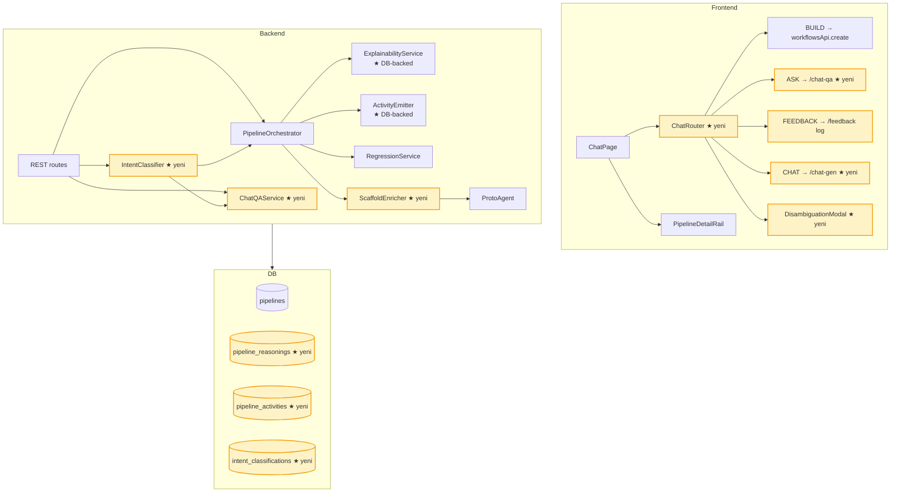
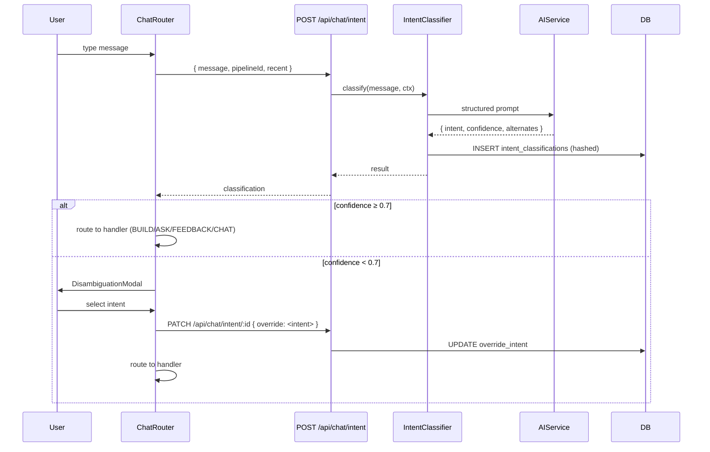
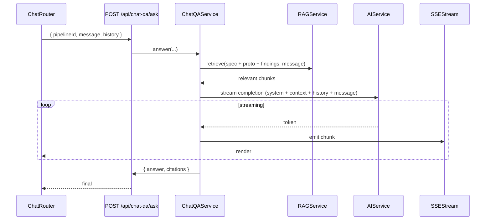
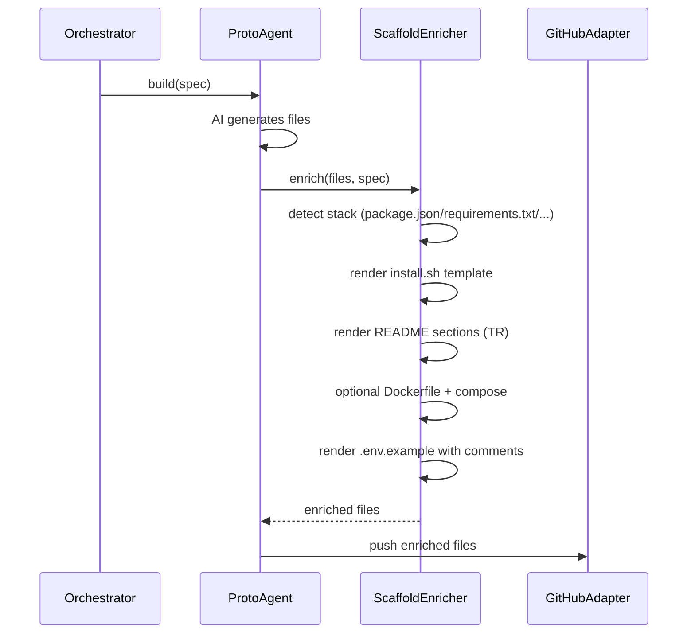

# 03 — Mimari & Teknik Tasarım

**Status:** ✍️ Taslak — onay bekliyor
**Önceki bağlam:** [`00-README.md`](./00-README.md), [`01-requirements.md`](./01-requirements.md), [`02-ux.md`](./02-ux.md)
**Mevcut mimari referansı:** [`docs/ARCHITECTURE.md`](../ARCHITECTURE.md)

> **Disiplin:** Bu doc "yeniden yazma" değil "delta planı". Her komponent için "bugün ne var" + "hedefte ne olacak" + "geçiş nasıl" kolonları. Mevcut çalışan yapıyı ezmeden, ekleyerek hedef mamuliyete çıkıyoruz.

---

## 1. Mevcut mimari (snapshot)

```mermaid
graph TB
  subgraph Frontend["Frontend (React 19 + Vite 7)"]
    UI[ChatPage / ChatPanel / Sidebar]
    UI --> RAIL[PipelineDetailRail]
    RAIL --> CINEMA[PipelineCinema]
    RAIL --> EXPL[ExplanationPanel]
    RAIL --> REG[RegressionPanel]
    UI --> SSE[usePipelineStream]
    UI --> API[HttpClient]
  end

  subgraph Backend["Backend (Fastify 4)"]
    ROUTES["/api/pipelines /api/auth /api/integrations ..."]
    ROUTES --> ORCH[PipelineOrchestrator FSM]
    ORCH --> SCRIBE[ScribeAgent]
    ORCH --> CRITIC[CriticAgent]
    ORCH --> PROTO[ProtoAgent]
    ORCH --> TRACE[TraceAgent]
    ORCH --> EXP[ExplainabilityService]
    ORCH --> ACT[ActivityEmitter]
    ORCH --> REGSVC[RegressionService]
    ORCH --> AI[AIService Provider Abstraction]
    PROTO --> GH[GitHubMCPAdapter / RESTAdapter]
    AI --> ANT[anthropic | openai | openrouter | mock]
  end

  subgraph DB["PostgreSQL 16 + Drizzle"]
    USERS[(users)]
    PIPES[(pipelines)]
    AIUSAGE[(ai_usage)]
    GHINT[(github_integrations)]
  end

  Backend --> DB
  Frontend -. SSE / fetch .-> Backend
```

**Kritik nokta:** `ExplainabilityService` ve `ActivityEmitter` **in-memory map / ring buffer** — backend restart'ta uçar. NFR-1 bu yüzden P1 önceliği.

---

## 2. Hedef mimari (delta'lar vurgulu)



Sarı = bu PDP-2 dalgasında eklenecek.

---

## 3. Yeni komponentler

### 3.1 `IntentClassifier` (FR-11)

**Yer:** `backend/src/pipeline/core/intent/IntentClassifier.ts`
**Bağımlılık:** AIService (mevcut)
**Sorumluluk:** Bir kullanıcı mesajını {BUILD, ASK, FEEDBACK, CHAT} sınıfına ayırmak + confidence skoru.

```ts
export interface IntentClassification {
  intent: 'BUILD' | 'ASK' | 'FEEDBACK' | 'CHAT';
  confidence: number;           // 0..1
  reasoning: string;            // kısa açıklama, log için
  alternates?: { intent, confidence }[]; // 2nd best
}

export class IntentClassifier {
  async classify(
    message: string,
    context: { pipelineId?: string; recentMessages?: string[] }
  ): Promise<IntentClassification>;
}
```

**Tasarım kararları:**
- AI prompt'u system message'da 4 sınıfı + örnekleri tanımlar; structured JSON output (Anthropic tool_use veya json_schema).
- Mock provider için deterministic keyword-based classifier (testler için).
- Result `intent_classifications` tablosuna log'lanır (audit + dataset).
- Confidence < 0.7 ise frontend disambiguation modal'ı tetiklenir.

### 3.2 `ChatQAService` (FR-10)

**Yer:** `backend/src/pipeline/core/chat-qa/ChatQAService.ts`
**Bağımlılık:** AIService, RAGService (mevcut), pipeline read API.
**Sorumluluk:** Pipeline tetiklemeden, mevcut spec/proto/findings context'inde kullanıcıya yanıt üretmek.

```ts
export class ChatQAService {
  async answer(
    pipelineId: string | null,
    message: string,
    history: ChatMessage[]
  ): Promise<{ answer: string; citations: Citation[] }>;
}
```

**Tasarım kararları:**
- RAG context: spec (`pipelines.approved_spec`), proto output (`pipelines.proto_output`), findings (`pipeline_reasonings`), regression report.
- Yanıt streaming SSE üzerinden frontend'e (mevcut SSE infra'sını paylaşır).
- "Bu yeni feature gibi duruyor — build mi edelim?" suggestion kuralı: yanıt agent tarafında "this needs implementation" işaretliyse FE seçenek gösterir.

### 3.3 `ScaffoldEnricher` (FR-6.5..6.8)

**Yer:** `backend/src/pipeline/agents/proto/ScaffoldEnricher.ts`
**Sorumluluk:** Proto output'una taşınabilirlik dosyaları eklemek.

**Üretilen dosyalar (stack tespitine göre):**
- `install.sh` / `setup.sh` — `bash` veya `pwsh`-uyumlu, idempotent (yeniden çalıştırılabilir)
- `README.md` — Türkçe, "Kendi bilgisayarında çalıştır" + "Sunucuya kur" sections
- `Dockerfile` + `docker-compose.yml` — opsiyonel, kullanıcı seçimine bağlı
- `.env.example` — placeholder + her satıra Türkçe yorum

Stack tespiti: `package.json` / `requirements.txt` / `go.mod` / `Cargo.toml` heuristics.

### 3.4 `ChatRouter` (FE) (FR-11 frontend tarafı)

**Yer:** `frontend/src/components/chat/ChatRouter.tsx`
**Sorumluluk:** Kullanıcı mesajını `IntentClassifier`'a gönder, sonuca göre 4 handler'a route et.

**Handler tipleri:**
1. `BUILD` → mevcut `workflowsApi.create` veya `iteration` flow
2. `ASK` → `chatQaApi.ask`
3. `FEEDBACK` → log + opsiyonel "düzeltelim mi?" prompt
4. `CHAT` → simple LLM chat (RAG'siz)

**Disambiguation:** Confidence < 0.7 → `DisambiguationModal` render.

---

## 4. Veritabanı tasarımı (NFR-1 + FR-11)

### 4.1 `pipeline_reasonings` (yeni)

ExplainabilityService'in in-memory map'inin DB hâli. Stage başına bir row.

```sql
CREATE TABLE pipeline_reasonings (
  id UUID PRIMARY KEY DEFAULT gen_random_uuid(),
  pipeline_id UUID NOT NULL REFERENCES pipelines(id) ON DELETE CASCADE,
  stage TEXT NOT NULL,                    -- 'scribe' | 'critic-spec' | 'proto' | 'critic-code' | 'trace'
  agent_reasoning JSONB NOT NULL,         -- AgentReasoning shape (decision, reasoning[], assumptions, confidence, risks, findings[])
  recorded_at TIMESTAMPTZ NOT NULL DEFAULT NOW(),
  archived_at TIMESTAMPTZ,                -- soft-delete (NFR-1.3)
  UNIQUE (pipeline_id, stage)             -- her stage başına son kayıt
);
CREATE INDEX idx_reasonings_pipeline ON pipeline_reasonings(pipeline_id);
```

**Soft-delete:** `archived_at IS NULL` filter default'ta uygulanır; "Arşiv" filtresi kaldırır.

### 4.2 `pipeline_activities` (yeni)

ActivityEmitter ring buffer'ının DB hâli. Append-only.

```sql
CREATE TABLE pipeline_activities (
  id BIGSERIAL PRIMARY KEY,
  pipeline_id UUID NOT NULL REFERENCES pipelines(id) ON DELETE CASCADE,
  stage TEXT NOT NULL,
  step TEXT NOT NULL,                     -- 'started' | 'progress' | 'complete' | 'error' | sub-step keys
  message TEXT,
  progress INTEGER,                       -- 0..100
  retry_count INTEGER DEFAULT 0,
  reasoning_snippet JSONB,                -- compact reasoning
  emitted_at TIMESTAMPTZ NOT NULL DEFAULT NOW()
);
CREATE INDEX idx_activities_pipeline_time ON pipeline_activities(pipeline_id, emitted_at);
```

**Retention:** İlk sürümde retention yok — pipeline silinince cascade. İleri sürümde > 90 gün eski activity'leri archive job ile arşivleyebiliriz (NFR-1.3 ile uyumlu).

### 4.3 `intent_classifications` (yeni)

Audit + ileride model fine-tuning için dataset.

```sql
CREATE TABLE intent_classifications (
  id BIGSERIAL PRIMARY KEY,
  user_id UUID NOT NULL REFERENCES users(id) ON DELETE CASCADE,
  pipeline_id UUID REFERENCES pipelines(id) ON DELETE SET NULL,
  message_hash TEXT NOT NULL,             -- SHA-256 of message (privacy)
  intent TEXT NOT NULL,
  confidence NUMERIC(4,3) NOT NULL,
  alternates JSONB,
  override_intent TEXT,                   -- kullanıcı disambiguation seçtiyse
  classified_at TIMESTAMPTZ NOT NULL DEFAULT NOW()
);
CREATE INDEX idx_intent_user_time ON intent_classifications(user_id, classified_at);
```

**Privacy:** Mesajın kendisi saklanmaz, sadece SHA-256 hash. Audit için yeterli; gerekirse user-id + zaman ile pipeline conversation'dan çıkarılır.

### 4.4 Migration sırası

1. `pipeline_reasonings` + `pipeline_activities` (NFR-1, F-03 fix)
2. `intent_classifications` (FR-11)

`drizzle-kit generate` + `drizzle-kit migrate`. Her migration kendi PR'ında.

### 4.5 Backfill stratejisi

Mevcut completed pipeline'lar için reasoning/activity yok (in-memory uçtu). Üç seçenek:

| Strateji | Etki | Karar |
|---|---|---|
| Boş bırak + bayrak ("eski oturumda tamamlandı") | UI'da "açıklama yok" mesajı | **Default** — basit, dürüst |
| AI'ya retroactif reasoning ürettir | Token + zaman maliyeti, sahte veri riski | Reddedildi |
| Manual seed test verisi | Sadece smoke için anlamlı | Reddedildi |

UI'da "**Bu pipeline persistence eklenmeden önce tamamlandı**" mesajı + "Yeniden çalıştır" butonu (opsiyonel, FR-9 iteration kullanır).

---

## 5. Kritik etkileşim sekansları

### 5.1 Persistence-aware reasoning emit (NFR-1)

```mermaid
sequenceDiagram
  participant ORCH as PipelineOrchestrator
  participant EXP as ExplainabilityService
  participant DB as PostgreSQL
  participant SSE as SSEStream
  participant FE as Frontend

  ORCH->>EXP: addReasoning(pipelineId, reasoning)
  EXP->>DB: UPSERT pipeline_reasonings (pipeline_id, stage)
  EXP->>SSE: emit reasoning event
  SSE-->>FE: partial reasoning update
  Note over EXP,DB: write-through; in-memory cache opsiyonel

  Note over FE: Page reload sonrası
  FE->>ORCH: GET /api/pipelines/:id/explanation
  ORCH->>EXP: getExplanation(pipelineId)
  EXP->>DB: SELECT FROM pipeline_reasonings WHERE pipeline_id=?
  EXP->>FE: full PipelineExplanation
```

### 5.2 Intent routing (FR-11)



### 5.3 Chat Q&A with RAG (FR-10)



### 5.4 Scaffold enrichment (FR-6.5..6.8)



---

## 6. Delta listesi (mevcut → hedef)

Her satır bir PR'lık delta. Sıra `06-roadmap.md` ile eşleşir.

| # | Komponent | Mevcut | Hedef | Tahmini efor | Bağımlı FR/NFR | Quality fence |
|---|---|---|---|---:|---|---|
| D-1 | `lastMessagesKeyRef` reset | Yeni Sohbet'te reset edilmiyor | Reset edilir | XS | F-01 / FR-12.2 | unit + e2e |
| D-2 | PipelineDetailRail body | overflow yok | `max-h-[60vh] overflow-y-auto` | XS | F-02 / FR-8.4 | snapshot + e2e |
| D-3 | Rail completed visibility | `idle && empty activities` → null | output varsa render | S | F-04 / FR-8.6 | unit |
| D-4 | DB: `pipeline_reasonings` + `pipeline_activities` | yok | yeni tablolar | M | NFR-1 / F-03 | migration test + integration |
| D-5 | ExplainabilityService persistence | in-memory | DB-backed (write-through) | M | NFR-1 | integration: restart sonrası recovery |
| D-6 | ActivityEmitter persistence | ring buffer | append-only DB + memory cache | M | NFR-1 | integration |
| D-7 | DB: `intent_classifications` | yok | yeni tablo | S | FR-11 | migration |
| D-8 | `IntentClassifier` service | yok | yeni service + tests | M | FR-11 | unit (mock) + integration (real provider) |
| D-9 | `POST /api/chat/intent` route | yok | yeni route | S | FR-11 | route test |
| D-10 | `ChatRouter` (FE) | mevcut handleSend monolitik | router pattern + 4 handler | M | FR-11 / FR-12 | vitest |
| D-11 | `DisambiguationModal` (FE) | yok | yeni component | S | FR-11.3 | vitest |
| D-12 | `ChatQAService` | yok | yeni service + RAG retrieval | M | FR-10 | unit + integration |
| D-13 | `POST /api/chat-qa/ask` route + SSE | yok | yeni route + stream | M | FR-10 | route + e2e streaming |
| D-14 | `ScaffoldEnricher` | yok | yeni service (FR-6.5..6.8) | M | FR-6 | unit + e2e proto generation |
| D-15 | Mode badge UX | tutarsız | tooltip veya kaldır (UX karar 02-ux) | S | F-05 / NFR-5.3 | manuel review |
| D-16 | Clarification anlık sayaç | "/4" delayed | seçim → anlık ✓ | S | F-07 / FR-3.2 | vitest |
| D-17 | ChatPage refactor | 1100+ satır | hook'lara böl (≤ 500 satır) | L | F-06 / NFR teknik borç | mevcut testler kalır |

**Efor sembolleri:** XS = ≤ 30 dk, S = 1 saat, M = 2-3 saat, L = 4+ saat.

---

## 7. Mimari kararlar (ADRs - kısa)

### ADR-1: ExplainabilityService write-through cache, lazy DB read

In-memory map'i atmıyoruz; reasoning add anında **hem cache hem DB** yazılır (write-through). Read önce cache'e bakar, miss varsa DB'den çeker. Gerekçe: SSE emit pipeline'da 5-50ms ek gecikme olmasın. NFR-3 latency hedefi.

### ADR-2: Activity'ler append-only, retention yok (v1)

Pipeline silinmediği sürece tüm activity'ler kalır. NFR-1.3 (immutable + arşiv) ile uyumlu. Volume riski: pipeline başına ~50-100 activity, 1000 pipeline'da ~50-100K satır — PostgreSQL için sorun değil.

### ADR-3: Intent classifier mock-first development

Backend test'lerinde mock provider deterministic regex tabanlı classifier. Real provider sadece integration suite'te. Bu, F-03 + FR-11 implementation'ını AI maliyeti olmadan PR-edilebilir kılar.

### ADR-4: ChatRouter FE-side, intent classifier backend

Intent classification AI çağrısı gerektirir → backend. Routing decision UI durumunu etkiler → frontend. Net ayrım: backend `{intent, confidence, alternates}` döner, frontend hangi handler'a gideceğine karar verir.

### ADR-5: ScaffoldEnricher Proto'nun bir parçası, ayrı agent değil

Proto agent zaten file generation yapıyor. Enricher ayrı bir agent olsa orchestrator FSM'inde yeni state gerekir → büyük değişim. Yerine: enricher ProtoAgent içinde son adım, post-AI-generation hook.

---

## 8. NFR ↔ Mimari eşleştirmesi

| NFR | Mimari kararlar |
|---|---|
| NFR-1 (kalıcılık) | D-4, D-5, D-6, ADR-1, ADR-2 |
| NFR-2 (resilience) | Mevcut retry + backoff korunur; F-03 fix sonrası backend restart kanıtlı recover |
| NFR-3 (perf) | ADR-1 (cache); SSE streaming; mevcut polling profili korunur |
| NFR-4 (a11y) | UI delta'ları (D-2, D-3, D-10, D-11) erişilebilirlik check ile gelir; quality.md'de detay |
| NFR-5 (usability) | Bakkal sözlüğü (02-ux) i18n catalogue'a uygulanır; D-14 ScaffoldEnricher Türkçe README üretir |
| NFR-6 (i18n) | Yeni component'ler i18n key'lerle gelir; activity event'leri zaten key tabanlı |

---

## 9. Riskler & azaltıcı önlemler

| Risk | Olasılık | Etki | Azaltıcı |
|---|---|---|---|
| F-03 migration mevcut data ile çakışır | Düşük | Orta | Migration boş tablo oluşturur, mevcut completed pipeline'lar için backfill yok (4.5) |
| Intent classifier mock-real divergence | Orta | Orta | Mock testleri tüm 4 sınıfı + low-conf path'i kapsar; real provider integration test'i nightly |
| ScaffoldEnricher stack-detection eksik | Orta | Düşük | Bilinmeyen stack için sadece README + .env.example üretilir, install.sh atlanır |
| ChatPage refactor (D-17) UX regression | Düşük | Orta | Mevcut testler ChatPage public davranışını gard ediyor; PR-by-PR refactor |

---

## 10. Kabul kriterleri (bu doc için)

- [ ] Mevcut snapshot + hedef diagram doğru (delta'lar yeşil/sarı vurgulu)
- [ ] 4 yeni komponent (IntentClassifier, ChatQAService, ScaffoldEnricher, ChatRouter) kapsamı net
- [ ] 3 yeni tablo schema'sı uygulanabilir (Drizzle generate test edilecek)
- [ ] Backfill stratejisi onaylandı (default: boş + bayrak)
- [ ] Delta listesi 06-roadmap için yeterli detay
- [ ] ADR'lar tutarlı

---

## 11. Sonraki adım

**04-quality.md**: bu mimari kararlardan + 01'in FR/NFR'lerinden test piramidi + per-delta acceptance criteria + CI gate matrisi.
