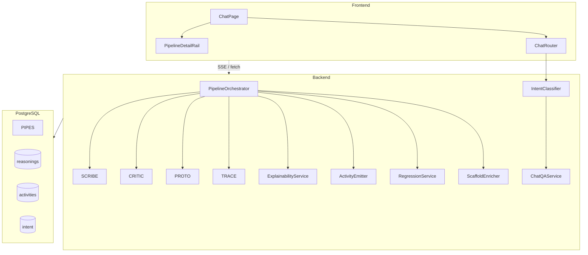
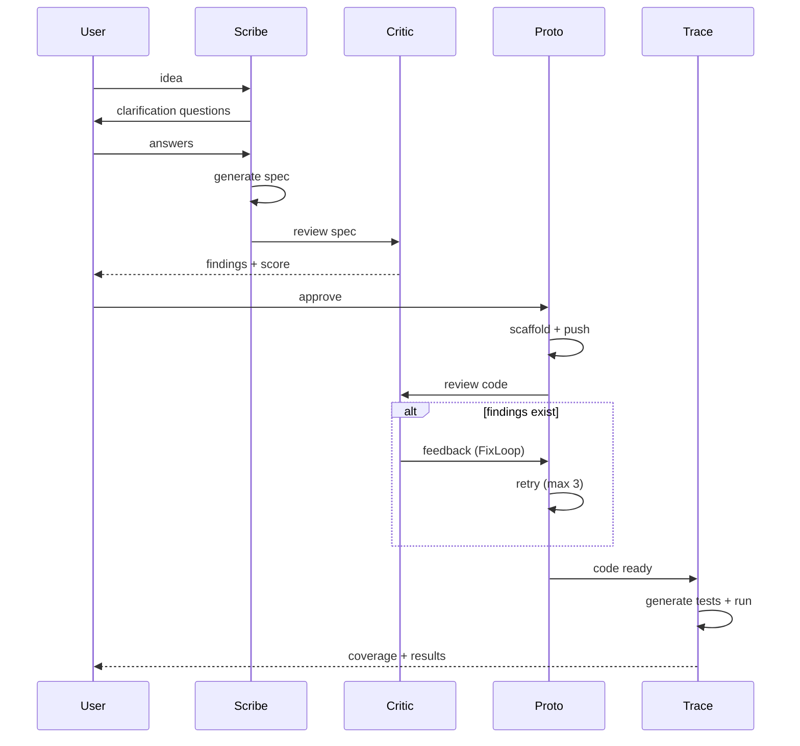

# 03 — Mimari

**Status:** ✍️ Skeleton — fill with data when available
**Bağımlılık:** [`02-literature.md`](./02-literature.md)
**Tahmini sayfa:** 15-20
**Kaynak:** `docs/ARCHITECTURE.md`, `docs/product/03-architecture.md`

> **Bölümün amacı:** AKIS'in sistem mimarisini akademik metinle anlatmak. Mevcut `docs/ARCHITECTURE.md` operasyonel referanstır; tez bu bölümde mimariyi **yaptığı işin gerekçesi + literatür motifleriyle bağı** ile sunar.

---

## 3.1 Genel mimari (overview)

> **Yazım hedefi (2-3 sayfa):** Yüksek seviye sistem komponentleri + tasarım kararları + diagram.

### 3.1.1 Sistem katmanları

| Katman | Teknoloji | Sorumluluk |
|---|---|---|
| Frontend | React 19 + Vite 7 + Tailwind v4 | SPA, chat UI, pipeline rail, açıklanabilirlik yüzeyi |
| Backend | Fastify 4 + TypeScript + Drizzle ORM | Pipeline orchestrator, ajan koordinasyonu, REST API, SSE streaming |
| Veritabanı | PostgreSQL 16 + pgvector | Conversation, pipeline state, reasoning, activities, RAG embeddings |
| AI Servisi | Anthropic / OpenAI / OpenRouter / mock | Provider-agnostic abstraction, model picker (planner / default / validation) |
| Adapter | GitHub MCP / GitHub REST | Proto'nun repo işlemleri için adapter pattern |

### 3.1.2 Tasarım kararları (rationale)

1. **Monolitik backend (modüler).** Microservices yerine modüler monolit — lisans projesi süresinde deploy/ops karmaşıklığı azaltır; ajan komponentleri bağımsız test edilebilir (FORGE'26 unit-of-test motifi).
2. **PostgreSQL + Drizzle.** ORM tip-güvenli; migration zinciri (0000-0048) audit trail oluşturur. pgvector RAG için.
3. **Fastify + plugin mimarisi.** Route'lar plugin olarak register edilir — testte `app.inject` ile isolation.
4. **Provider-agnostic AI service.** `AI_PROVIDER=mock` ile token harcamadan dev; gerçek koşum Anthropic Haiku (baseline) / Sonnet (kalite gerektiren).

### 3.1.3 Genel mimari diagramı



[FIG-1]: bu diagramın akademik renderı (defense PDF'i için).

---

## 3.2 Pipeline orchestrator

> **Yazım hedefi (2-3 sayfa):** FSM (Finite State Machine) tasarımı, state transitions, hata kurtarma.

### 3.2.1 State machine

```
scribe_clarifying
  → scribe_generating
  → critic_reviewing_spec
  → awaiting_approval (insan kapısı)
  → proto_building
  → critic_reviewing_code
  → fix_loop_iteration (opsiyonel, 3 deneme)
  → trace_testing
  → ci_running
  → completed | completed_partial | failed | cancelled
```

[FIG-2]: state diagram.

### 3.2.2 Orchestrator sorumluluğu

- **Stage transitions:** her ajanın output'unu validate et + sonraki stage'i tetikle.
- **Error handling:** AI provider 5xx → retry (3 deneme, exponential backoff — NFR-2.1).
- **Persistence:** her transition `pipelines` tablosuna yazılır; reasoning + activity da DB'ye (NFR-1).
- **Cancellation:** user cancel → temiz durdurma (NFR-2.5).

### 3.2.3 Adapter pattern

Proto'nun GitHub işlemleri:
- `GitHubMCPAdapter` — Model Context Protocol gateway (dev/test)
- `GitHubRESTAdapter` — Doğrudan REST API (production)
- Aynı interface (`createRepo`, `pushFiles`, `openPR`) — runtime'da `GITHUB_ADAPTER` env var ile seçilir.

---

## 3.3 Verification chain (Scribe → Critic → Proto → Trace + FixLoop)

> **Yazım hedefi (3-4 sayfa):** Bu tezin **core mimari katkısı** — her ajanı tek tek anlat, literatür motifiyle bağla.

### 3.3.1 Scribe — fikir → spec

- **Input:** kullanıcı serbest metni ("bakkal için veresiye defteri istiyorum")
- **Output:** structured spec (`userStories[]`, `acceptanceCriteria[]`, `problemStatement`, `technicalConstraints`)
- **Mekanizma:**
  1. Clarification — 3-5 multiple-choice soru üret (FR-3.1)
  2. Spec generation — cevaplardan structured spec (FR-3.3)
  3. Plan card — human-readable özet (FR-3.4)
- **AgentReasoning:** decision + reasoning + assumptions + confidence + risks (ExplainabilityService'e yazılır)

### 3.3.2 Critic — adversarial review

- **6 boyut:** completeness, ambiguity, testability, consistency, spec_compliance, security
- **Output:** her boyut için skor + finding listesi + overall skor + karar (approved / rejected)
- **Threshold:** overall ≥ 80 → approved (kullanıcı yine de son söz)
- **İki noktada çalışır:**
  1. Spec review (Scribe sonrası — FR-4.1)
  2. Code review (Proto sonrası — FR-4.5)
- **Literatür motif:** adversarial review (ASDLC, SentinelOne) + multi-agent debate (Du 2023)

### 3.3.3 Proto — spec → kod

- **Input:** approved spec
- **Output:** GitHub repo + scaffold dosyaları + push
- **Mekanizma:**
  1. Repo açma (kullanıcı adına, OAuth token — FR-6.1)
  2. Scaffold üretimi (LLM ile, AI service abstraction)
  3. **ScaffoldEnricher** (FR-6.5..6.8 — § 3.6 detay) — install.sh + Türkçe README + Dockerfile + .env.example
  4. Push (MCP veya REST adapter)
- **Hata yönetimi:** GitHub push fail → bakkal-Türkçesi mesaj + retry button (NFR-2.4)

### 3.3.4 Trace — kod → test

- **Input:** Proto output + spec acceptance criteria
- **Output:** BDD feature dosyaları + Playwright e2e testler + coverage matrix
- **Mekanizma:**
  1. AC → Gherkin scenario dönüşümü (FR-7.1)
  2. Playwright test generation (FR-7.2)
  3. Coverage matrix — hangi AC test edildi, hangisi edilmedi (FR-7.3)
- **Opsiyonel skip:** kullanıcı seçerse pipeline `completed_partial` ile biter (FR-7.4)

### 3.3.5 FixLoop — adversarial loop

- **Tetikleyici:** Critic code review veya Trace test failure
- **Mekanizma:**
  1. Finding'i Proto'ya feedback olarak ver
  2. Proto retry — 3 deneme limiti
  3. Hâlâ fail → `completed_partial` + kullanıcıya manuel iyileştirme önerisi
- **Literatür motif:** Reflexion (NeurIPS 2023) + Self-Refine

### 3.3.6 Insan onay kapısı

- **Position:** Critic-spec sonrası, Proto'ya geçmeden önce.
- **Kaldırılamaz:** kullanıcı son sözü söyler — Critic onaylasa bile (FR-4.3).
- **Literatür motif:** Human-on-the-Loop (HOTL) — adaptif otonomi.

### 3.3.7 Pipeline akış sekansı



[FIG-3]

---

## 3.4 Persistence layer (NFR-1)

> **Yazım hedefi (2 sayfa):** PDP-2 dalgasında çözülen in-memory volatility problemi. Tezin "kalite-güveni kalıcılığı" iddiası için kritik.

### 3.4.1 Problem (PDP-2 öncesi)

- `ExplainabilityService` — in-memory `Map<pipelineId, AgentReasoning[]>`
- `ActivityEmitter` — in-memory ring buffer, 5 dk TTL
- **Sonuç:** backend restart → reasoning + activity uçtu → tamamlanmış pipeline'da "Henüz açıklama yok" (F-03 finding'i)
- **Tez bağlamı:** verification chain'in **görsel kanıtı** uçucu → "kalite-güveni kalıcı değil" → core iddia zayıflar.

### 3.4.2 Çözüm (PDP-2 wave 2 — PR #517)

- `pipeline_reasonings` tablosu (Drizzle migration `0047_pipeline_reasonings_and_activities.sql`) — pipelineId + stage + AgentReasoning blob + archived_at
- `pipeline_activities` tablosu — append-only event log
- Write-through cache: in-memory + DB synchronization
- **Backfill stratejisi:** eski completed pipeline'lar boş — UI'da "Bu pipeline persistence öncesi tamamlandı" bayrağı

### 3.4.3 NFR-1 metrik

- **NFR-1.1:** backend restart sonrası reasoning %100 geri gelir → `/api/pipelines/:id/explanation` 200 + non-empty stages
- **NFR-1.3:** soft-delete only — kullanıcı arşivleyebilir ama hard-delete yok (audit trail koruması)

[FIG-4]: persistence layer diagramı (Service → Cache → DB write-through).

---

## 3.5 Intent classifier + chat-qa surface (FR-10/11)

> **Yazım hedefi (2-3 sayfa):** PDP-2 wave 4 — chat conversational surface.

### 3.5.1 Problem (PDP-2 öncesi)

- Her kullanıcı mesajı pipeline'a gidiyordu.
- "12 dosya çok mu az mı?" sorusu → AKIS Scribe tetikliyor → bakkal kafa karışıklığı.
- Iteration mode "completed → yeni mesaj → child pipeline" → her durumda BUILD varsayımı.

### 3.5.2 Intent classifier (FR-11)

- **4 sınıf:** BUILD (yeni özellik) / ASK (soru) / FEEDBACK (geribildirim) / CHAT (genel sohbet)
- **Threshold:** confidence ≥ 0.7 → handler tetiklenir; < 0.7 → DisambiguationModal (4 buton — FR-11.3)
- **Audit:** `intent_classifications` tablosu (Drizzle migration `0048_add_intent_classifications.sql`) — SHA-256 hash only (NFR-1.3 privacy)
- **Endpoint:** `POST /api/chat/intent` + `PATCH /api/chat/intent/:classificationId` (kullanıcı override)

### 3.5.3 ChatQAService (FR-10)

- **Mekanizma:** RAG-augmented SSE streaming
- **Context:** spec, Proto kodu, findings, regression report
- **Endpoint:** `POST /api/chat-qa/ask` (SSE)
- **"Bu pipeline gerektirir" durumu:** AKIS user'a "Bu yeni özellik gibi, build mi edelim?" der → BUILD intent'e elden geçer (FR-10.4)

### 3.5.4 ChatRouter (frontend)

- Intent → handler dispatch:
  - BUILD → `workflowsApi.create` (mevcut pipeline tetikleyici)
  - ASK → `chatQaApi.ask()` (SSE)
  - FEEDBACK → log + agent_message + "düzeltelim mi?" CTA
  - CHAT → conversational response (PDP-3'te full implementation; PDP-2'de placeholder)

[FIG-5]: chat router + intent classifier diagramı.

---

## 3.6 Scaffold portability (FR-6.5..6.8)

> **Yazım hedefi (1.5-2 sayfa):** PDP-2 wave 3 — bakkal'ın çıktıyı kendi bilgisayarında / sunucuda çalıştırması için scaffold zenginleştirme.

### 3.6.1 Problem

- Proto sadece minimum scaffold (package.json, README, src/) üretiyordu.
- Bakkal "GitHub'ı bilmiyorum, kodu nasıl çalıştırırım?" → terk.

### 3.6.2 ScaffoldEnricher (`backend/src/pipeline/agents/proto/ScaffoldEnricher.ts`)

- **Post-AI hook:** Proto'nun LLM-üretimi scaffold'una otomatik eklenir.
- **Stack tespiti:** `package.json`, `requirements.txt`, vb. dosyalardan stack çıkarımı (8 stack desteği).
- **Render:** stack'e göre template:
  - `install.sh` (macOS + Linux + WSL test edilmiş — FR-6.5)
  - Türkçe README ("Kendi bilgisayarında çalıştır" + "Sunucuya kur" bölümleri — FR-6.6)
  - Opsiyonel `Dockerfile` + `docker-compose.yml` (default üret — FR-6.7)
  - `.env.example` + port/secret yönergesi (FR-6.8)

### 3.6.3 Bakkal-language disiplini

- README komutları yorumlu: `npm install  # bu komut bağımlılıkları kurar`
- Bakkal-language sözlüğü (`docs/product/02-ux.md` § 6) — "repo" → "depo", "PR" → "değişiklik teklifi"
- Audit script: `scripts/lint/bakkal-language.mjs` — NFR-5.1 ihlali sayısı [BAKKAL-AUDIT]

---

## 3.7 API surface ve i18n

> **Yazım hedefi (1 sayfa):** Genişletilen REST API + frontend i18n.

### 3.7.1 PDP-2 ile eklenen route'lar

| Route | Sorumluluk |
|---|---|
| `GET /api/pipelines/:id/explanation` | Agent reasoning + attention points (Level-4 surface) |
| `GET /api/pipelines/:id/regression` | Iteration regression confidence |
| `POST /api/chat/intent` | Intent classification |
| `PATCH /api/chat/intent/:classificationId` | User override after disambiguation |
| `POST /api/chat-qa/ask` | Chat Q&A (SSE streaming) |

### 3.7.2 i18n (TR + EN)

- 1436 key — TR ↔ EN tam senkron (NFR-6.1)
- Pipeline activity event'leri i18n key kullanır → frontend `t()` (NFR-6.2)
- Bakkal-language katalog tüm metinler için aktif

---

## 3.8 Güvenlik ve hata kurtarma

> **Yazım hedefi (1 sayfa):** Tezin core iddiası "kalite-güveni" — güvenlik *birincil değil* ama temel beklentiler karşılanır.

- Cookie-based auth (HttpOnly + Secure + SameSite=Lax)
- AI API keys AES-256-GCM şifreli DB
- Rate limiting (Fastify plugin)
- CORS origin kontrolü
- IDOR koruması (PR #519 — kullanıcı-controlled id'li route'larda `WHERE user_id = currentUserId`)
- SSE error sanitization (PR #520 — raw stack-trace user'a sızmaz, bakkal-Türkçesi mesaj)
- Intent classifier mesaj içeriği saklamaz — SHA-256 hash only

**Future work (Bölüm 6.3'te):** CriticAgent prompt-injection robustness, AST DeterministicValidator.

---

## 3.9 Mimari kararları özeti (ADR-style)

| Karar | Alternatif | Tercih sebebi |
|---|---|---|
| Modüler monolit | Microservices | Lisans projesi süresi, deploy basitliği |
| Fastify + plugin | Express + middleware | Test isolation (`app.inject`), tip güvenliği |
| PostgreSQL + Drizzle | Prisma + Supabase | Migration audit trail, pgvector RAG |
| Provider-agnostic AI | Tek-vendor (örn. OpenAI-only) | Dev'de mock; runtime'da Anthropic/OpenRouter switch |
| Adapter pattern (GitHub) | Direct REST coupling | MCP gateway vs REST esnekliği |
| FSM orchestrator | Saga pattern | State transitions explicit + test edilebilir |
| Write-through cache (NFR-1) | DB-only | Hot path latency; restart resilience |
| SSE streaming | WebSocket | Tek-yönlü push yeter; HTTP semantics |

---

## Kabul kriterleri (bu doc için)

- [ ] 3.1 → genel mimari diagram (FIG-1) okuyucuya net
- [ ] 3.3 → 4 ajan + FixLoop + insan kapısı (bu tezin core katkısı)
- [ ] 3.4 → NFR-1 persistence öncesi/sonrası net
- [ ] 3.5 → FR-10/11 chat surface açıklandı
- [ ] 3.6 → FR-6.5..6.8 scaffold portability
- [ ] Her mimari karar literatür motifine veya FR/NFR ID'sine bağlı

## Placeholder'lar (grep edilebilir)

- `[FIG-1]` ... `[FIG-5]` — mimari diagramlar (mermaid → PNG defense'te)
- `[BAKKAL-AUDIT]` — § 3.6.3 audit warn count
